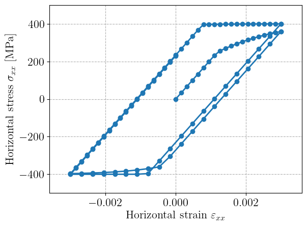

# Objectives 

This tutorial shows how we can use the Python
[`MFrontGenericSupportInterface`](https://thelfer.github.io/mgis/web/index.html)
to interact with a small-strain mechanical behaviour compiled with
MFront.

The corresponding behaviour is a small-strain von Mises plasticity model
with non-linear isotropic hardening and is implemented in the
`SmallStrainPlasticity.mfront` file using the
[`StandardElastoViscoPlasticity`
brick](https://thelfer.github.io/tfel/web/StandardElastoViscoPlasticityBrick.html).
Some material parameters (elastic parameters) are hard-coded in the file
while others (plastic parameters) are declared as material properties to
be specified by the user.

The following implementation shows:

- how to read information from the compiled behaviour, such as the
  declared internal state variable names or material properties
- how to set up material properties
- how to impose values for the total strain, call the behaviour
  integration for a batch of quadrature points and update the mechanical
  state for subsequent time steps
- how to locally solve a non-linear system involving the computed
  tangent operator

> **External files**
> 
> This tutorial can be run in a `jupyter` notebook using the
> following files:
> 
> - [`mgis_small_strain.ipynb`](ipynb/mgis_small_strain.ipynb)
> - [`SmallStrainPlasticity.mfront`](mfront/SmallStrainPlasticity.mfront)

# Problem setting

Regarding the final point, we aim to solve for a uniaxial stress state
along the $x$ direction, while controlling the imposed horizontal strain
$\epsilon$.

The remaining components $\varepsilon_{ij}$ are considered as unknowns
and we want to solve the following problem at a given imposed horizontal
strain: find $\boldsymbol{\varepsilon}$ such that
\[
\boldsymbol{R}(\boldsymbol{\varepsilon}) = \begin{Bmatrix}
\varepsilon_{xx} - \epsilon \\
\sigma_{yy}(\boldsymbol{\varepsilon}) \\
\sigma_{zz}(\boldsymbol{\varepsilon}) \\
\sigma_{xy}(\boldsymbol{\varepsilon}) \\
\sigma_{xz}(\boldsymbol{\varepsilon}) \\
\sigma_{yz}(\boldsymbol{\varepsilon})
\end{Bmatrix} = 0
\]

To solve this non-linear problem, we write a custom Newton-Raphson
method which will involve the following jacobian:
\[
\boldsymbol{J} = \dfrac{\partial \boldsymbol{R}}{\partial \boldsymbol{\varepsilon}} = \begin{bmatrix} 
\begin{bmatrix} 1 & 0 & \ldots & 0\end{bmatrix}\\
\bar{C}_\text{tang}
\end{bmatrix}
\]
where $\bar{\boldsymbol{C}}_\text{tang}$ is the sub-matrix obtained by
removing the first row from the tangent stiffness
$\boldsymbol{C}_\text{tang} = \dfrac{\partial
\boldsymbol{\sigma}}{\partial \boldsymbol{\varepsilon}}$.

In the following, we will compute the behaviour integration and the
above non-linear resolution for a batch of `ngauss` points for
illustration purposes. For simplicity, we will impose the same strain
$\epsilon$ for all points, yielding the same response for all points but
different strain values could also be considered for the different
material points.

> **Note**
>
> To treat a batch of integration points, we rely on the
> `MaterialDataManager` class. This is the most commonly
> used class in `python`.
>
> In contrast, in solvers developped using a compiled
> language like `C++`, `fortran` and `C`, most developers
> wants more control on how memory is handled. In
> this case, `mgis` provides the `BehaviourData` and
> `BehaviourDataView` classes which are suitable
> to deal with a single integraiton point.
>
> Those various solutions are described in depth
> in the [`C++` tutorial](bindings-cxx.html).

> **Note**
>
> This tutorial aims at illustrating how to
> use `MGIS` in `python` on a simple example.
>
> To describe a single integration point, the usage
> of the `mtest` module (provided by the `TFEL`
> project if the `python` bindings are enabled)
> is strongly advocated.
>
> See [this page](https://thelfer.github.io/tfel/web/mtest-python.html)
> for details.

# Implementation

## Compiling the behaviour

First, we call the following command to compile the MFront behaviour:

```bash
mfront --obuild --interface=generic SmallStrainPlasticity.mfront
```

This should only be done once and for all if the behaviour
implementation does not change anymore.

Shared libraries are then stored in the `src/libBehaviour.so` file which
will be used to load the behaviour.

```python
import subprocess
import numpy as np
import mgis.behaviour as mgis_bv

behaviour_name = "SmallStrainPlasticity"
subprocess.call(["mfront", "--obuild", "--interface=generic", behaviour_name+".mfront"]);
```

```txt
Treating target : all
The following library has been built :
- libBehaviour.so :  SmallStrainPlasticity_AxisymmetricalGeneralisedPlaneStrain SmallStrainPlasticity_Axisymmetrical SmallStrainPlasticity_PlaneStrain SmallStrainPlasticity_GeneralisedPlaneStrain SmallStrainPlasticity_Tridimensional
```

> **Note**
>
> If the `TFEL` project (which provides `MFront`) has been compiled
> with the `python` bindings enabled, then the `mfront`
> `python` module provides a more direct way of compiling `MFront`
> behaviours, allowing to retrieve the name of the generated
> libraries and behaviours.
>
> See [this page](https://thelfer.github.io/tfel/web/mfront-python.html)
> for details about the `mfront` module.

## Loading the behaviour

We first need to choose the modeling hypothesis. Here, we will work with
3D states and thus choose the `Tridimensional` hypothesis. Behaviours
are loaded differently depending on whether we work with a small or
finite-strain setting. We use the `isStandardFiniteStrainBehaviour`
function to check whether the behaviour is finite strain or not. The
finite-strain case is described in another demo.


```python
lib_path = "src/libBehaviour.so"
hypothesis = mgis_bv.Hypothesis.Tridimensional

is_finite_strain = mgis_bv.isStandardFiniteStrainBehaviour(lib_path, behaviour_name)
if is_finite_strain:
    print("Finite strain behaviour detected.")
    bopts = mgis_bv.FiniteStrainBehaviourOptions()
    bopts.stress_measure = mgis_bv.FiniteStrainBehaviourOptionsStressMeasure.PK2
    bopts.tangent_operator = (
        mgis_bv.FiniteStrainBehaviourOptionsTangentOperator.DPK1_DF
    )
    behaviour = mgis_bv.load(bopts, lib_path, behaviour_name, hypothesis)
else:
    print("Small strain behaviour detected.")
    behaviour = mgis_bv.load(lib_path, behaviour_name, hypothesis)
```

```txt
Small strain behaviour detected.
```

The `Behaviour` object now contains several information about the
behaviour implementation such as names and types of gradients and
thermodynamic forces and external or internal state variables.

Here, we work with a purely mechanical behaviour so that gradients
consist only of the total strain `Strain`. The resulting thermodynamic
stress is `Stress`.

By default, `Temperature` is always declared as an external state
variable by `MFront`.

> **Note**
>
> The automatic declaration of the `Temperature` comes from the
> fact that many solvers adopted the `UMAT` interface which
> treats the temperature specifically.
>
> If portability is not an issue (the `generic` interface is
> the only one that supports this feature), the automatic
> declaration can be disabled by modifying the
> declaration of the domain specific language
> in the `MFront` file as follows:
>
> ~~~~{.cxx}
> @DSL Implicit{
>   automatic_declaration_of_the_temperature_as_first_external_state_variable: false
> }
> ~~~~

Finally, since we are dealing with an elastoplastic behaviour with
isotropic hardening, the internal state variables are the
`ElasticStrain` and the `EquivalentPlasticStrain`. The former is a
symmetric tensor whereas the latter is only a scalar.

```python
print("Kinematic type:", behaviour.getKinematic())
print("Gradient names:", [s.name for s in behaviour.gradients])
print("Thermodynamic forces names:", [s.name for s in behaviour.thermodynamic_forces])

print(
    "External state variable names:",
    [s.name for s in behaviour.external_state_variables],
)
print(
    "Internal state variable names:",
    [s.name for s in behaviour.internal_state_variables],
)
print(
    "Internal state variable types:",
    [s.type for s in behaviour.internal_state_variables],
)
```

```txt
Kinematic type: SmallStrainKinematic
Gradient names: ['Strain']
Thermodynamic forces names: ['Stress']
External state variable names: ['Temperature']
Internal state variable names: ['ElasticStrain', 'EquivalentPlasticStrain']
Internal state variable types: [mgis.behaviour.VariableType.STENSOR, mgis.behaviour.VariableType.SCALAR]
```

The size of these different quantities can be checked. Symmetric tensors
in 3D are represented here as arrays of size 6 (using Mandel notation,
see [Tensors in
MFront](https://thelfer.github.io/tfel/web/tensors.html)).


```python
for s in behaviour.gradients + behaviour.thermodynamic_forces + behaviour.internal_state_variables: 
    print(f"{s.name} is of size {mgis_bv.getVariableSize(s, hypothesis)}")
```

```txt
Strain is of size 6
Stress is of size 6
ElasticStrain is of size 6
EquivalentPlasticStrain is of size 1
```

For more complex behaviours, different "blocks" of tangent operators can
be declared and computed. The names of the tangent blocks can be
retrieved as shown below. Here, we have a simple mechanical behaviour so
that the only tangent operator is the tangent stiffness
$\boldsymbol{C}_\text{tang} = \dfrac{\partial
\boldsymbol{\sigma}}{\partial \boldsymbol{\varepsilon}}$.


```python
print(
    "Tangent operator block names:",
    [f"d{s[0].name}_d{s[1].name}" for s in behaviour.tangent_operator_blocks],
)
```

```txt
Tangent operator block names: ['dStress_dStrain']
```

Finally, names of material properties can also be retrieved easily as
follows:

```python
print(
    "Material property names:",
    [s.name for s in behaviour.material_properties],
)
```

```txt
Material property names: ['InitialYieldStress', 'FinalYieldStress', 'HardeningCoefficient']
```

Other information such as behaviour material symmetry or predefined
parameters can also be obtained as follows:


```python
print(behaviour.symmetry)
print(behaviour.parameters)
```

```txt
Isotropic
['epsilon', 'theta', 'YoungModulus', 'PoissonRatio', 'RelativeValueForTheEquivalentStressLowerBoundDefinition', 'minimal_time_step_scaling_factor', 'maximal_time_step_scaling_factor', 'numerical_jacobian_epsilon']
```

## Setting up the material data manager

The material data manager will be the data structure which will hold the
information about the mechanical state and tangent operator for a single
or a batch of integration points during a given time step. We first set
up the data manager by declaring the number of integration points we
want to handle.


```python
ngauss = 3
data = mgis_bv.MaterialDataManager(behaviour, ngauss)
```

Values at the beginning of the time step will be stored in `data.s0`.
This object is a `StateManager` which holds values of the gradients,
thermodynamic forces and internal state variables.

A similar one is stored in `data.s1` which will hold values at the end
of the current time step, once behaviour integration has been performed.

Here, by default, `Strain` is initialized with a zero tensor, as well as
all other variables. We see below that `data.s0.gradients` is of shape
`ngauss x 6` corresponding to the 6 components of the `ngauss`
integration points.


```python
print("Gradients:")
print("  Beginning of time step:\n", data.s0.gradients)
print("  End of time step:\n", data.s1.gradients)

print("Thermodynamic forces:")
print("  Beginning of time step:\n", data.s0.thermodynamic_forces)
print("  End of time step:\n", data.s1.thermodynamic_forces)
```

```txt
Gradients:
  Beginning of time step:
 [[0. 0. 0. 0. 0. 0.]
 [0. 0. 0. 0. 0. 0.]
 [0. 0. 0. 0. 0. 0.]]
  End of time step:
 [[0. 0. 0. 0. 0. 0.]
 [0. 0. 0. 0. 0. 0.]
 [0. 0. 0. 0. 0. 0.]]
Thermodynamic forces:
  Beginning of time step:
 [[0. 0. 0. 0. 0. 0.]
 [0. 0. 0. 0. 0. 0.]
 [0. 0. 0. 0. 0. 0.]]
  End of time step:
 [[0. 0. 0. 0. 0. 0.]
 [0. 0. 0. 0. 0. 0.]
 [0. 0. 0. 0. 0. 0.]]
```

Conversely, internal state variables are of shape `ngauss x 7` with
components of `ElasticStrain` and `EquivalentPlasticStrain` being
concatenated.


```python
print("Internal state variables:")
print("  Beginning of time step:\n", data.s0.internal_state_variables)
print("  End of time step:\n", data.s1.internal_state_variables)
```

```txt
Internal state variables:
  Beginning of time step:
 [[0. 0. 0. 0. 0. 0. 0.]
 [0. 0. 0. 0. 0. 0. 0.]
 [0. 0. 0. 0. 0. 0. 0.]]
  End of time step:
 [[0. 0. 0. 0. 0. 0. 0.]
 [0. 0. 0. 0. 0. 0. 0.]
 [0. 0. 0. 0. 0. 0. 0.]]
```

## Declare material properties

In order to perform the behaviour integration, we need to declare the
values for the material properties which are yet unspecified. We also
need to declare the value of the temperature, although it is not used in
practice. Note that we can declare different values at the beginning and
at the end of the time step, although here we use the same values.
Finally, we would also apply different values for the different
integration points, if needed.


```python
for state_manager in [data.s0, data.s1]:
    mgis_bv.setMaterialProperty(state_manager, "InitialYieldStress", 250e6)
    mgis_bv.setMaterialProperty(state_manager, "FinalYieldStress", 400e6)
    mgis_bv.setMaterialProperty(state_manager, "HardeningCoefficient", 1000.)

    mgis_bv.setExternalStateVariable(state_manager, "Temperature", 293.15)
```

## Defining the load-stepping scheme and the nonlinear system 

Below, we will impose a cyclic loading in terms of imposed horizontal
strain. The value of the time step `dt` must be provided but is
irrelevant here since we are dealing with a rate-independent behaviour.


```python
# strain history
N = 20
eps_max = 3e-3
eps_list = np.concatenate((np.linspace(0, eps_max, N), np.linspace(eps_max, -eps_max, N), np.linspace(-eps_max, 0, N))*2)

dt = 0
```

We now implement the expression of the global residual $\boldsymbol{R}$
and its jacobian $\boldsymbol{J}$. As stresses are expressed here in Pa,
we use a scaling of `1e-9` to scale the stress components to values
close to strain values.


```python
stress_scaling = 1e-9
def residual(eps, sig, imposed_eps):
    return np.concatenate((eps[:,[0]]-imposed_eps, sig[:,1:]*stress_scaling), axis=1)
def jacobian(eps, sig, Ct):
    Jac = np.zeros_like(Ct)
    Jac[:,0,0] = 1
    Jac[:,1:,:] = Ct[:,1:,:]*stress_scaling
    return Jac
```

Integration of the material behaviour will be done by specifying that we
want to compute the consistent tangent operator.

We then implement the time stepping loop and the Newton-Raphson
resolution.

We recall that the values of the total strain are all assumed to be
unknown and will be stored in the `eps` variable, the latter being
initialized with the strain values at the beginning of the time step.

During a Newton-Raphson iteration, the strain values at the end of the
time step are updated with the current value for `eps`. Then,
integration is performed using `mgis_bv.integrate`. Next, we retrieve
the new value for the stress, stored in `sig` and of the tangent
operator, stored in `Ct`.

We evaluate the residual $\boldsymbol{R}$ and perform the Newton
correction to `eps` by solving the jacobian system. Finally, we report
the horizontal stress value at the first integration point (we can check
that all `ngauss` points give the same value).

Before going to the next load step, the computed state must be updated
using `mgis_bv.update(data)` which copies the computed state `s1` into
`s0`.


```python
integration_type = mgis_bv.IntegrationType.IntegrationWithConsistentTangentOperator
rtol = 1e-8
atol = 1e-8
niter_max = 20

Sxx = np.zeros_like(eps_list)
for i, eps_imposed in enumerate(eps_list):
    eps = np.copy(data.s0.gradients)
    sig = np.copy(data.s0.thermodynamic_forces)

    # Newton-Raphson solve
    nres = 1
    nres0 = max(np.linalg.norm(residual(eps, sig, eps_imposed),axis=1))
    niter = 0
    while (nres > max(atol, rtol * nres0)) and (niter < niter_max):
        data.s1.gradients[:] = eps

        integration_status = mgis_bv.integrate(data, integration_type, dt, 0, ngauss)
        assert integration_status > 0, "Behaviour integration has failed."

        sig = data.s1.thermodynamic_forces
        Ct = data.K

        res = residual(eps, sig, eps_imposed)
        nres = max(np.linalg.norm(res, axis=1))
        # print(f"Iteration {niter}, residual = {nres}")

        Jac = jacobian(eps, sig, Ct)
        for k in range(ngauss):
            eps[k,:] += np.linalg.solve(Jac[k,:,:], -res[k,:])

        niter += 1

    assert niter <= niter_max, "Newton method did not converge within maximum number of iterations."

    Sxx[i] = data.s1.thermodynamic_forces[0, 0]

    mgis_bv.update(data)
```

Plotting the horizontal stress strain evolutions shows the expected
behaviour with a first yielding at 250 MPa and a saturation at 400 MPa
in both tension and compression.


```python
import matplotlib.pyplot as plt
plt.plot(eps_list, Sxx*1e-6, '-o')
plt.xlabel(r"Horizontal strain $\varepsilon_{xx}$")
plt.ylabel(r"Horizontal stress $\sigma_{xx}$ [MPa]")
plt.xlim(-1.2*eps_max, 1.2*eps_max)
plt.ylim(-500, 500)
plt.show()
```
    

    

