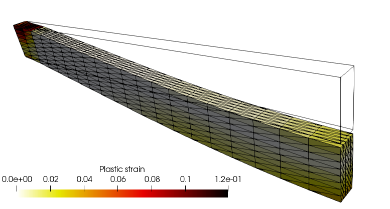

% Finite-strain elastoplasticity within the logarithmic strain framework
% Jérémy Bleyer, Thomas Helfer
% 17/04/2020

This demo is dedicated to the resolution of a finite-strain elastoplastic problem using the logarithmic strain framework proposed in <cite data-cite="miehe_anisotropic_2002">(Miehe et al., 2002)</cite>. 

# Logarithmic strains 

This framework expresses constitutive relations between the Hencky
strain measure $\boldsymbol{H} = \dfrac{1}{2}\log
(\boldsymbol{F}^T\cdot\boldsymbol{F})$ and its dual stress measure
$\boldsymbol{T}$. This approach makes it possible to extend classical
small strain constitutive relations to a finite-strain setting. In
particular, the total (Hencky) strain can be split **additively** into
many contributions (elastic, plastic, thermal, swelling, etc.). Its
trace is also linked with the volume change
$J=\exp(\operatorname{tr}(\boldsymbol{H}))$. As a result, the
deformation gradient $\boldsymbol{F}$ is used for expressing the Hencky
strain $\boldsymbol{H}$, a small-strain constitutive law is then written
for the $(\boldsymbol{H},\boldsymbol{T})$-pair and the dual stress
$\boldsymbol{T}$ is then post-processed to an appropriate stress measure
such as the Cauchy stress $\boldsymbol{\sigma}$ or Piola-Kirchhoff
stresses.

# MFront implementation

The logarithmic strain framework discussed in the previous paragraph
consists merely as a pre-processing and a post-processing stages of the
behaviour integration. The pre-processing stage compute the logarithmic
strain and its increment and the post-processing stage interprets the
stress resulting from the behaviour integration as the dual stress
$\boldsymbol{T}$ and convert it to the Cauchy stress.

`MFront` provides the `@StrainMeasure` keyword that allows to specify
which strain measure is used by the behaviour. When choosing the
`Hencky` strain measure, `MFront` automatically generates those pre- and
post-processing stages, allowing the user to focus on the behaviour
integration.

This leads to the following implementation (see the [small-strain
elastoplasticity
example](mgis_fenics_small_strain_elastoplasticity.html) for details
about the various implementation available):

```cpp
@DSL Implicit;

@Behaviour IsotropicLinearHardeningPlasticity;
@Author Thomas Helfer/Jérémy Bleyer;
@Date 07 / 04 / 2020;

@StrainMeasure Hencky;

@Algorithm NewtonRaphson;
@Epsilon 1.e-14;
@Theta 1;

@MaterialProperty stress s0;
s0.setGlossaryName("YieldStress");
@MaterialProperty stress H0;
H0.setEntryName("HardeningSlope");

@Brick StandardElastoViscoPlasticity{
  stress_potential : "Hooke",
  inelastic_flow : "Plastic" {
    criterion : "Mises",
    isotropic_hardening : "Linear" {H : "H0", R0 : "s0"}
  }
};
```

# FEniCS implementation

We define a box mesh representing half of a beam oriented along the
$x$-direction. The beam will be fully clamped on its left side and
symmetry conditions will be imposed on its right extremity. The loading
consists of a uniform self-weight.


{width=75%}

```python
import matplotlib.pyplot as plt
from dolfin import *
import mgis.fenics as mf
import numpy as np
import ufl

length, width, height = 1., 0.04, 0.1
nx, ny, nz = 20, 5, 8
mesh = BoxMesh(Point(0, -width/2, -height/2.), Point(length, width/2, height/2.), nx, ny, nz)

V = VectorFunctionSpace(mesh, "CG", 2)
u = Function(V, name="Displacement")

def left(x, on_boundary):
    return near(x[0], 0) and on_boundary
def right(x, on_boundary):
    return near(x[0], length) and on_boundary

bc = [DirichletBC(V, Constant((0.,)*3), left),
      DirichletBC(V.sub(0), Constant(0.), right)]

selfweight = Expression(("0", "0", "-t*qmax"), t=0., qmax = 50e6, degree=0)

file_results = XDMFFile("results/finite_strain_plasticity.xdmf")
file_results.parameters["flush_output"] = True
file_results.parameters["functions_share_mesh"] = True
```

The `MFrontNonlinearMaterial` instance is loaded from the MFront
`LogarithmicStrainPlasticity` behaviour. This behaviour is a
finite-strain behaviour (`material.finite_strain=True`) which relies on
a kinematic description using the total deformation gradient
$\boldsymbol{F}$. By default, a MFront behaviour always returns the
Cauchy stress as the stress measure after integration. However, the
stress variable dual to the deformation gradient is the first
Piloa-Kirchhoff (PK1) stress. An internal option of the MGIS interface
is therefore used in the finite-strain context to return the PK1 stress
as the "flux" associated to the "gradient" $\boldsymbol{F}$. Both
quantities are non-symmetric tensors, aranged as a 9-dimensional vector
in 3D following [MFront conventions on
tensors](http://tfel.sourceforge.net/tensors.html).


```python
material = mf.MFrontNonlinearMaterial("../materials/src/libBehaviour.so",
                                      "LogarithmicStrainPlasticity")
print(material.behaviour.getBehaviourType())
print(material.behaviour.getKinematic())
print(material.get_gradient_names(), material.get_gradient_sizes())
print(material.get_flux_names(), material.get_flux_sizes())
```

    StandardFiniteStrainBehaviour
    F_CAUCHY
    ['DeformationGradient'] [9]
    ['FirstPiolaKirchhoffStress'] [9]


The `MFrontNonlinearProblem` instance must therefore register the
deformation gradient as `Identity(3)+grad(u)`. This again done
automatically since `"DeformationGradient"` is a predefined gradient.
The following message will be shown upon calling `solve`: ``` Automatic
registration of 'DeformationGradient' as I + (grad(Displacement)). ```
The loading is then defined and, as for the [small-strain
elastoplasticity
example](mgis_fenics_small_strain_elastoplasticity.html), state
variables include the `ElasticStrain` and `EquivalentPlasticStrain`
since the same behaviour is used as in the small-strain case with the
only difference that the total strain is now given by the Hencky strain
measure. In particular, the `ElasticStrain` is still a symmetric tensor
(vector of dimension 6). Note that it has not been explicitly defined as
a state variable in the MFront behaviour file since this is done
automatically when using the `IsotropicPlasticMisesFlow` parser.

Finally, we setup a few parameters of the Newton non-linear solver.


```python
problem = mf.MFrontNonlinearProblem(u, material, bcs=bc)
problem.set_loading(dot(selfweight, u)*dx)

p = problem.get_state_variable("EquivalentPlasticStrain")
epsel = problem.get_state_variable("ElasticStrain")
print("'ElasticStrain' shape:", ufl.shape(epsel))

prm = problem.solver.parameters
prm["absolute_tolerance"] = 1e-6
prm["relative_tolerance"] = 1e-6
prm["linear_solver"] = "mumps"
```

    'ElasticStrain' shape: (6,)


During the load incrementation, we monitor the evolution of the vertical downwards displacement at the middle of the right extremity.

This simulation is a bit heavy to run so we suggest running it in parallel:
```bash
mpirun -np 4 python3 finite_strain_elastoplasticity.py
```


```python
P0 = FunctionSpace(mesh, "DG", 0)
p_avg = Function(P0, name="Plastic strain")

Nincr = 30
load_steps = np.linspace(0., 1., Nincr+1)
results = np.zeros((Nincr+1, 3))
for (i, t) in enumerate(load_steps[1:]):
    selfweight.t = t
    print("Increment ", i+1)
    problem.solve(u.vector())

    results[i+1, 0] = -u(length, 0, 0)[2]
    results[i+1, 1] = t

    file_results.write(u, t)
    p_avg.assign(project(p, P0))
    file_results.write(p_avg, t)
```

    Increment  1
    Automatic registration of 'DeformationGradient' as I + (grad(Displacement)).
    
    Automatic registration of 'Temperature' as a Constant value = 293.15.
    
    Increment  2
    Increment  3
    Increment  4
    Increment  5
    Increment  6
    Increment  7
    Increment  8
    Increment  9
    Increment  10
    Increment  11
    Increment  12
    Increment  13
    Increment  14
    Increment  15
    Increment  16
    Increment  17
    Increment  18
    Increment  19
    Increment  20
    Increment  21
    Increment  22
    Increment  23
    Increment  24
    Increment  25
    Increment  26
    Increment  27
    Increment  28
    Increment  29
    Increment  30


The load-displacement curve exhibits a classical elastoplastic behaviour rapidly followed by a stiffening behaviour due to membrane catenary effects. 


```python
plt.figure()
plt.plot(results[:, 0], results[:, 1], "-o")
plt.xlabel("Displacement")
plt.ylabel("Load");
```


