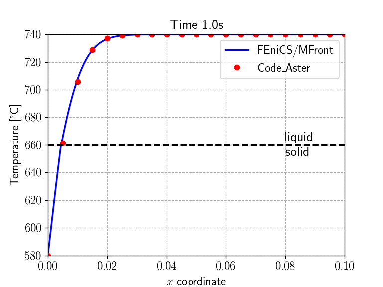
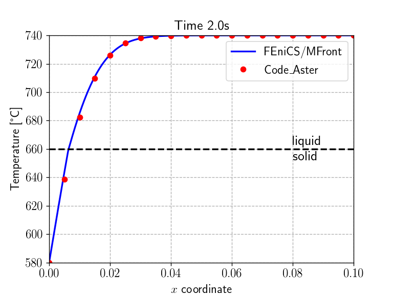
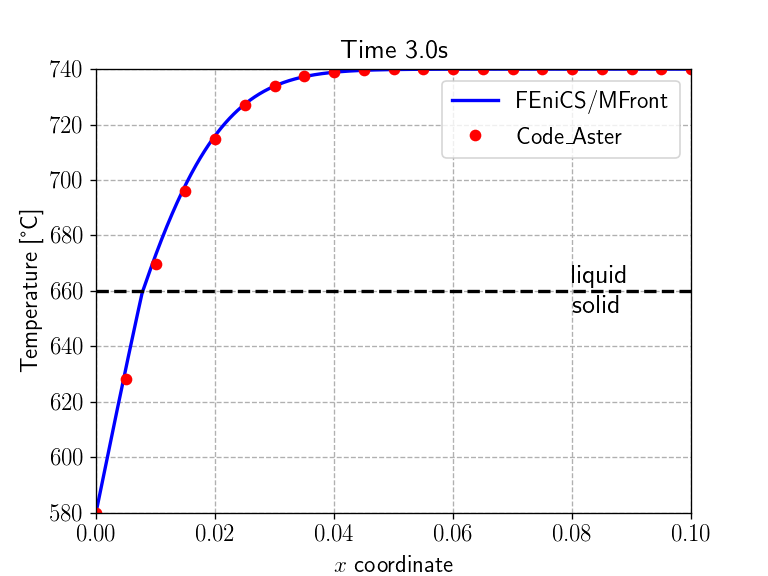
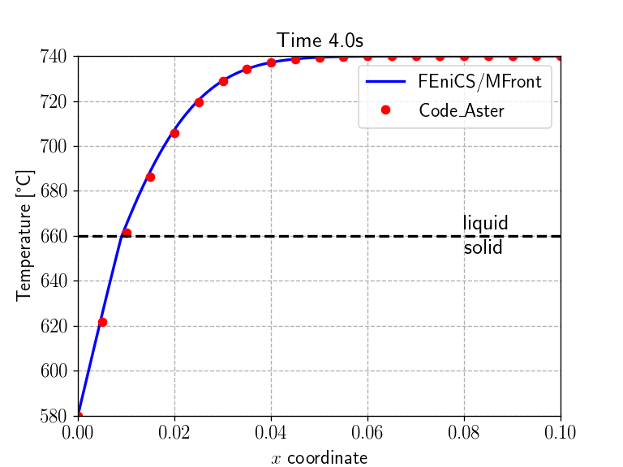
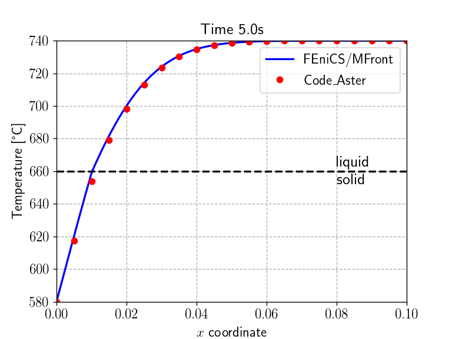
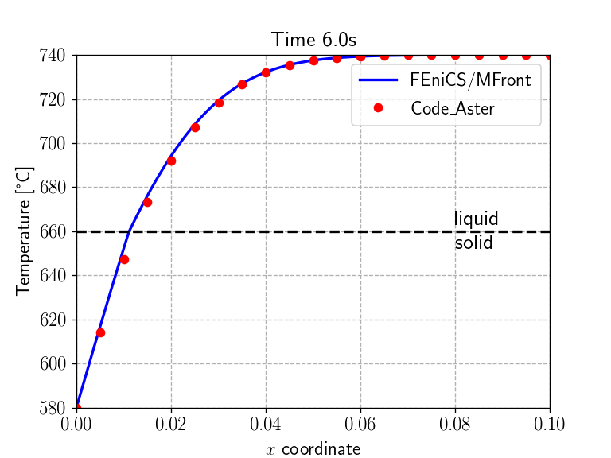

<!--
pandoc --pdf-engine=xelatex -F pandoc-crossref -F pandoc-citeproc --highlight-style=tango mgis_fenics_heat_equation_phase_change.md -o mgis_fenics_heat_equation_phase_change.pdf 
-->

\newcommand{\bj}{\mathbf{j}}
\renewcommand{\div}{\operatorname{div}}

In this demo, we expand on the [stationnary nonlinear heat transfer
demo](https://thelfer.github.io/mgis/web/mgis_fenics_nonlinear_heat_transfer.html)
and consider a transient heat equation with non-linear heat transfer law
including solid/liquid phase change. This demo corresponds to the
[TTNL02 elementary test
case](https://www.code-aster.org/V2/doc/default/fr/man_v/v4/v4.22.002.pdf)
of the [`code_aster` finite-element
software](https://www.code-aster.org).

<!--
<p align="center">

</p>
-->

> **Source files:**
>
> * Jupyter notebook: [mgis_fenics_heat_equation_phase_change.ipynb](https://gitlab.enpc.fr/navier-fenics/mgis-fenics-demos/raw/master/demos/heat_equation_phase_change/mgis_fenics_heat_equation_phase_change.ipynb)
> * Python file: [mgis_fenics_heat_equation_phase_change.py](https://gitlab.enpc.fr/navier-fenics/mgis-fenics-demos/raw/master/demos/heat_equation_phase_change/mgis_fenics_heat_equation_phase_change.py)
> * MFront behaviour file: [HeatTransferPhaseChange.mfront](https://gitlab.enpc.fr/navier-fenics/mgis-fenics-demos/raw/master/demos/heat_equation_phase_change/HeatTransferPhaseChange.mfront)

# Transient heat equation using an enthalpy formulation

The transient heat equation writes:

$$
\rho C_p \dfrac{\partial T}{\partial t} = r-\div\bj
$$

where $\rho$ is the material density, $C_p$ the heat capacity (at
constant pressure) per unit of mass, $r$ represents heat sources and
$\bj$ is the heat flux.

In the case of phase changes, the heat capacity exhibits large
discontinuities near the transition temperature. It is therefore more
suitable to work with the enthalpy density defined as:

$$
h(T) = \int_{T_0}^{T} \rho C_p dT
$$

yielding the following heat equation:
$$
\dfrac{\partial h}{\partial t} = r-\div\bj
$$

# Description of the non-linear heat transfer law with phase change

The thermal material is described by the following non linear Fourier
Law:

$$
\mathbf{j}=-k\left(T\right)\,\mathbf{\nabla} T
$$

where the thermal conductivity $k$ is initially assumed to be given by:

$$
k\left(T\right)=\begin{cases}
k_s & \text{if }T < T_m \\
k_l & \text{if }T > T_m 
\end{cases}
$$
where $k_s$ (resp. $k_l$) denotes the solid (resp. liquid) phase
conductivity and $T_m$ is the solid/liquid transition temperature.

The enthalpy is assumed to be given by:

$$
h\left(T\right)=\begin{cases}
c_sT & \text{if }T < T_m \\
c_l(T-T_m)+c_sT_m+\Delta h_{s/l} & \text{if }T > T_m 
\end{cases}
$$

where $c_s=\rho_sC_{p,s}$ (resp. $c_l=\rho_lC_{p,l}$) is the volumic
heat capacity of the solid (resp. liquid) phase. It can be observed that
the enthalpy exhibits a discontinuity at the phase transition equal to
$\Delta h_{s/l}$ which represents the latent heat of fusion per unit
volume.

<p align="center">

</p>

# A smoothed version

The enthalpy discontinuity $\Delta h_{s/l}$ poses convergence
difficulties for the Newton resolution. A classical remedy consists in
considering a smoothed version of the previous law, such as:

$$
k\left(T\right)=\begin{cases}
k_s & \text{if }T < T_s \\
k_s + (k_l-k_s)\dfrac{T-T_s}{T_\text{smooth}} & \text{if } T_s \leq T \leq T_l\\
k_l & \text{if }T > T_l 
\end{cases}
$$
and
$$
h\left(T\right)=\begin{cases}
c_sT & \text{if }T < T_s \\
c_sT_s+\left(\dfrac{cs+cl}{2}+\dfrac{\Delta h_{s/l}}{T_\text{smooth}}\right)(T-T_s) & \text{if } T_s \leq T \leq T_l \\
c_l(T-T_l)+c_sT_s+\dfrac{cs+cl}{2}T_\text{smooth}+\Delta h_{s/l} & \text{if }T > T_l 
\end{cases}
$$
where $T_{smooth}=T_l-T_s$ is a small transition temperature interval
between $T_s=T_m-T_\text{smooth}/2$ the solidus temperature and
$T_l=T_m+T_\text{smooth}/2$ the liquidus temperature.

# `MFront` implementation

## Gradient, flux and tangent operator blocks

Similarly to the [stationnary nonlinear heat transfer
demo](mgis_fenics_nonlinear_heat_transfer.html), the `MFront`
implementation relies on the `DefaultGenericBehaviour` DSL and declares
the pair of temperature gradient and heat flux. In addition, the volumic
enthalpy $h$ is also declared as an internal state variable. In addition
to the two tangent operator blocks `∂j∕∂Δ∇T` and `∂j∕∂ΔT` already
discussed in the first demo, we also declare the additional block
`∂h∕∂ΔT`, referring to the fact that the enthalpy will vary with the
temperature and will enter the transient heat equation.

``` cpp
@DSL DefaultGenericBehaviour;
@Behaviour HeatTransferPhaseChange;
@Author Thomas Helfer / Jérémy Bleyer;
@Date 15 / 02 / 2019;

@Gradient TemperatureGradient ∇T;
∇T.setGlossaryName("TemperatureGradient");

@Flux HeatFlux j;
j.setGlossaryName("HeatFlux");

@StateVariable real h;
h.setEntryName("Enthalpy"); //per unit of volume

@AdditionalTangentOperatorBlock ∂j∕∂ΔT;
@AdditionalTangentOperatorBlock ∂h∕∂ΔT;
```
## Material parameters and local variables

We now declare the various material properties corresponding to those of aluminium. The material parameters are assumed to be uniform for both phases. Finally, we also introduce the smoothing temperature width $T_\text{smooth}$. 
```cpp
@Parameter Tₘ = 933.15;        // [K]
Tₘ.setEntryName("MeltingTemperature");
@Parameter kₛ = 210;           // [W/m/K]
kₛ.setEntryName("SolidConductivity");
@Parameter cₛ = 3.e6;          // [J/m^3/K]
cₛ.setEntryName("SolidHeatCapacity");
@Parameter kₗ = 95;            // [W/m/K]
kₗ.setEntryName("LiquidConductivity");
@Parameter cₗ = 2.58e6;        // [J/m^3/K]
cₗ.setEntryName("LiquidHeatCapacity");
@Parameter Δhₛₗ = 1.08048e9;   // [J/m^3]
Δhₛₗ.setEntryName("FusionEnthalpy");
@Parameter Tₛₘₒₒₜₕ = 0.1;      // smoothing temperature width [K]
Tₛₘₒₒₜₕ.setEntryName("Tsmooth");
```

We define some local variables corresponding to the values of the conductivity $k$, the volumic heat capacity $c$ and the derivative of the heat conductivity with respect to the temperature.

```cpp
@LocalVariable thermalconductivity k;
@LocalVariable real c;
@LocalVariable real ∂k∕∂T;
```

## Integration of the behaviour

Again, the behaviour integration is straightforward: after computing the
temperature at the end of the time step `T_`, we compute the thermal
conductivity, its derivative with respect to the temperature, the
volumic enthalpy and the volumic heat capacity depending on whether `T_`
belongs to the solid state ($T\leq T_s$), the liquid state ($T\geq T_l$)
or to the transition region ($T_s \leq T \leq T_l$). We finish by
computing the heat flux.

``` cpp
@Integrator {
  const auto T_ = T + ΔT;     // current temperature
  const auto Tₛ = Tₘ-Tₛₘₒₒₜₕ/2; // solidus temperature
  const auto Tₗ = Tₘ+Tₛₘₒₒₜₕ/2; // liquidus temperature
  if(T_<Tₛ){                  // solid state
    k = kₛ;
    c = cₛ;
    h = cₛ*T_;
    ∂k∕∂T = 0.;
  } else if (T_ > Tₗ) {        // liquid state
    k = kₗ;
    c = cₗ;
    h = cₗ*(T_-Tₗ)+Δhₛₗ+cₛ*Tₛ+(cₛ+cₗ)*Tₛₘₒₒₜₕ/2;
    ∂k∕∂T = 0.;
  } else {                    // solid/liquid smooth transition
    k = kₛ + (kₗ-kₛ)*(T_-Tₛ)/Tₛₘₒₒₜₕ;
    h = cₛ*Tₛ+((cₛ+cₗ)/2+Δhₛₗ/Tₛₘₒₒₜₕ)*(T_-Tₛ);
    c = Δhₛₗ/(Tₗ-Tₛ);
    ∂k∕∂T = -(kₗ-kₛ)/Tₛₘₒₒₜₕ;
  }
  // heat flux
  j = -k ⋅ (∇T + Δ∇T);
}  // end of @Integrator
```

# Tangent operator

The computation of the tangent operator blocks is then straightforward:
```cpp
@TangentOperator {
  ∂j∕∂Δ∇T = -k * tmatrix<N, N, real>::Id();
  ∂j∕∂ΔT = ∂k∕∂T * (∇T + Δ∇T);
  ∂h∕∂ΔT = c;
}  // end of @TangentOperator
```

# FEniCS implementation

## Geometry and material

We consider a rectanglar domain of length 0.1 with imposed temperatures
`T0` (resp. `Ti`) on the left (resp. right) boundaries. We look here for
the temperature field `T` using a $P^2$-interpolation which is initially
at the uniform temperature `Ti`.

```python
%matplotlib notebook
import matplotlib.pyplot as plt
from dolfin import *
import mgis.fenics as mf
import numpy as np

length = 0.1
width = 0.01
Nx = 1000
Ny = 5
mesh = RectangleMesh(Point(0., 0.), Point(length, width), Nx, Ny, "crossed")
x = np.linspace(0, length, Nx)

V = FunctionSpace(mesh, "CG", 2)
T = Function(V, name="Temperature")

def left(x, on_boundary):
    return near(x[0], 0) and on_boundary
def right(x, on_boundary):
    return near(x[0], length) and on_boundary

T0 = Constant(853.15)
Ti = Constant(1013.15)
T.interpolate(Ti)

bc = [DirichletBC(V, T0, left),
      DirichletBC(V, Ti, right)]
```

We now load the material behaviour `HeatTransferPhaseChange` and also
change the default value of `Tsmooth` to a slightly larger one (but
still sufficiently small). Note that the mesh must be sufficiently
refined to use a smaller value. Indeed, the spatial resolution must be
able to capture with a few elements the sharp transition which will
occur during the phase change. We also verify that 3 different tangent
blocks have indeed been defined, the last one involving the internal
state variable `Enthalpy` with respect to the temperature.

```python
material = mf.MFrontNonlinearMaterial("./src/libBehaviour.so",
                                      "HeatTransferPhaseChange",
                                      hypothesis="plane_strain",
                                       parameters={"Tsmooth": 1.})
print(["d{}_d{}".format(*t) for t in material.get_tangent_block_names()])
```

    ['dHeatFlux_dTemperatureGradient', 'dHeatFlux_dTemperature', 'dEnthalpy_dTemperature']


## Time discretization of the heat equation

The heat equation must also be discretized in time. We use here the
$\theta$-method and approximate:

$$
\left.\dfrac{\partial h}{\partial t}\right|_{t=t_{n+\theta}} \approx \dfrac{h_{t=t_{n+1}}-h_{t=t_{n}}}{\Delta t} = r_{t=t_{n+\theta}}-\div\bj_{t=t_{n+\theta}}
$$

where $\star_{t=t_{n+\theta}}=
\theta\star_{t=t_{n+1}}+(1-\theta)\star_{t=t_{n}}$.

The weak formulation therefore reads (in the absence of source terms):

Find $T\in V$ such that:
$$
\int_\Omega \left((h_{t=t_{n+1}}(T)-h_{t=t_{n}})\widehat{T} - \Delta t (\theta\mathbf{j}_{t=t_{n+1}}(T, \nabla T)+(1-\theta)\mathbf{j}_{t=t_{n}})\cdot \nabla \widehat{T} \right)\text{ dx} = 0
$$

in which, at time $t_{n+1}$, both the enthalpy $h_{t=t_{n+1}}$ and the
heat flux $\mathbf{j}_{t=t_{n+1}}$ are non-linear functions of the
unknown temperature.

## Problem formulation

We therefore see that the above non-linear problem does not fit into the
default form of a `MFrontNonlinearProblem` residual. We will therefore
have to specify its form manually. To do so, we need to get the
functions `h` and `j` associated to the current values of the enthalpy
and the heat flux.

Second, we must call the `initialize` method which initializes the
functions associated with gradients, fluxes, external and internal state
variables objects and the corresponding tangent blocks. All gradients
and external state variables must have been registered before calling
this method. In this case, we rely on the automatic registration of the
temperature and its gradient.

Finally, to implement the $\theta$ time discretization scheme, we will
also need to keep track of the enthalpy and heat flux values at the
previous time step. We can simply define these new functions as deep
copies of `h` and `j`. Doing so, `h_old` and `j_old` will also be
Quadrature functions.

```python
problem = mf.MFrontNonlinearProblem(T, material, quadrature_degree=2, bcs=bc)
h = problem.get_state_variable("Enthalpy")
j = problem.get_flux("HeatFlux")
problem.initialize()

j_old = j.copy(deepcopy=True)
h_old = h.copy(deepcopy=True)
```

```
    Automatic registration of 'TemperatureGradient' as grad(Temperature).
    
    Automatic registration of 'Temperature' as an external state variable.
```
    
## Residual definition and tangent form computation

We are now ready to define the expression of the above residual. Note
that we must use the integration measure `dx` associated with the
`MFrontNonlinearProblem` containing the correct quadrature degree
matching that of the various Quadrature functions. Finally, the tangent
form can be automatically computed using the `compute_tangent_form`
method from the residual expression and the structure of the different
tangent blocks.


```python
dt = Constant(0.)
theta = Constant(1.)
T_ = TestFunction(V)
j_theta = theta*j + (1-theta)*j_old
problem.residual = (T_*(h - h_old)-dt*dot(grad(T_), j_theta))*problem.dx
problem.compute_tangent_form()
```

## Time-stepping loop and comparison with `code_aster` results

We now implement the time-stepping loop which simply solves the
non-linear problem and update the fields corresponding to the values at
the previous time step. We also load the values of the one-dimensional
temperature field $T(x, t)$ given in the `code_aster` test-case and
compare them with what we obtain every second.

```python
cA_results = np.loadtxt("results_code_Aster.csv", delimiter=",")
code_Aster_times = np.arange(1, 7)
Nsteps = 60
times = np.linspace(0, 6., Nsteps+1)
for (t, delta_t) in zip(times[1:], np.diff(times)):
    dt.assign(Constant(delta_t))
    
    problem.solve(T.vector())

    h_old.assign(h) # update enthalpy
    j_old.assign(j) # update heat flux

    sol_time = np.isclose(t, code_Aster_times)
    if any(sol_time):
        plt.figure()
        plt.title("Time {:0.1f}s".format(t), fontsize=16)
        ax1 = plt.gca()
        ax1.set_xlabel('$x$ coordinate')
        ax1.set_ylabel('Temperature [°C]')
        ax1.plot(x, np.array([T(xi, width/2)-273.15 for xi in x]), "-b", label="FEniCS/MFront")
        ax1.plot(cA_results[:, 0], cA_results[:, np.where(sol_time)[0]+1], "or", label="Code\_Aster")
        Tm = material.get_parameter("MeltingTemperature") - 273.15
        ax1.plot(x, Tm + 0*x, "--k")
        ax1.annotate("liquid\nsolid", xy=(0.08, Tm), fontsize=16, va="center")
        plt.legend()
        plt.show()
```

```
    <IPython.core.display.Javascript object>
```

{width=75%}

```
    <IPython.core.display.Javascript object>
```

{width=75%}

```
    <IPython.core.display.Javascript object>
```

{width=75%}

```
    <IPython.core.display.Javascript object>
```
 
{width=75%}

```
    <IPython.core.display.Javascript object>
```

{width=75%}


```
    <IPython.core.display.Javascript object>
```

{width=75%}
